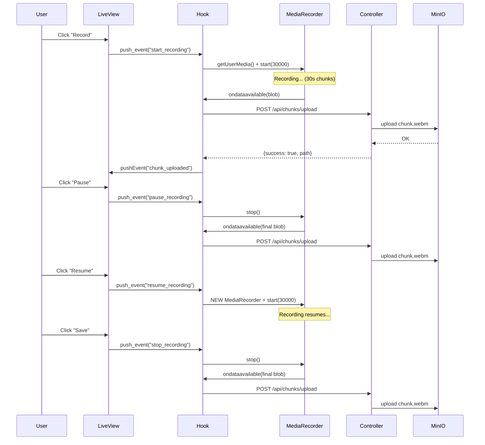

# Audio Recording System - Technical Documentation

## Overview

Real-time audio recording system with chunk-based storage in MinIO. Records audio in 30-second segments and allows pause/resume functionality while maintaining valid WebM files.

## Architecture

```mermaid
graph TB
    subgraph Browser
        UI[LiveView UI<br/>test_live.ex]
        Hook[JS Hook<br/>recorder.ts]
        MediaRecorder[MediaRecorder API]
    end

    subgraph Phoenix
        Controller[ChunkController]
        MinioService[Minio Service]
    end

    subgraph Storage
        MinIO[(MinIO<br/>roda/audio-chunks/)]
    end

    UI -->|phx-click events| Hook
    Hook -->|getUserMedia| MediaRecorder
    MediaRecorder -->|ondataavailable<br/>every 30s| Hook
    Hook -->|POST /api/chunks/upload<br/>FormData| Controller
    Controller -->|upload_audio_chunk| MinioService
    MinioService -->|S3 PUT| MinIO
    Controller -->|{success, path}| Hook
    Hook -->|pushEvent chunk_uploaded| UI
```

## Recording Flow



## Chunking Strategy

### Why 30-second chunks?

1. **Memory efficiency**: Small chunks prevent browser memory overflow
2. **Network resilience**: If upload fails, only lose 30s of audio
3. **Processing parallelization**: Chunks can be processed independently

### Chunk Generation Triggers

| Trigger | When | Result |
|---------|------|--------|
| **Timer (30s)** | Every 30 seconds during recording | Auto-generated chunk via `start(30000)` |
| **Pause** | User clicks Pause | `stop()` → finalizes current chunk |
| **Resume** | User clicks Resume | **New MediaRecorder** created |
| **Save** | User clicks Save | `stop()` → finalizes final chunk |

### Why restart MediaRecorder on Resume?

**Problem with `pause()`/`resume()`:**
```javascript
// ❌ BAD: requestData() during pause creates corrupted files
mediaRecorder.pause();
mediaRecorder.requestData(); // Creates incomplete WebM (missing headers)
```

**Solution: stop()/new MediaRecorder:**
```javascript
// ✅ GOOD: stop() properly finalizes WebM file
pauseRecording() {
  this.isPaused = true;
  this.mediaRecorder.stop(); // Generates valid WebM with headers
}

resumeRecording() {
  // New MediaRecorder reuses existing stream (no permission re-request)
  this.startRecording();
}
```

**Benefits:**
- ✅ Each chunk is a **valid, standalone WebM file**
- ✅ Chunks can be played individually with `ffplay`
- ✅ No corruption or "Invalid data" errors
- ✅ Stream persists (no microphone permission re-request)

## File Storage

### MinIO Structure

```
roda/
└── audio-chunks/
    ├── 3eeb0c7e-cc6a-4cbe-af5b-349f55853acb.webm
    ├── 50360630-4003-482d-b9be-d429eecd23b8.webm
    └── ...
```

### File Naming

- **Format**: `{UUID}.webm`
- **UUID**: Generated server-side via `Ecto.UUID.generate()`
- **Extension**: Determined by browser MIME type (webm, wav, mp4)
